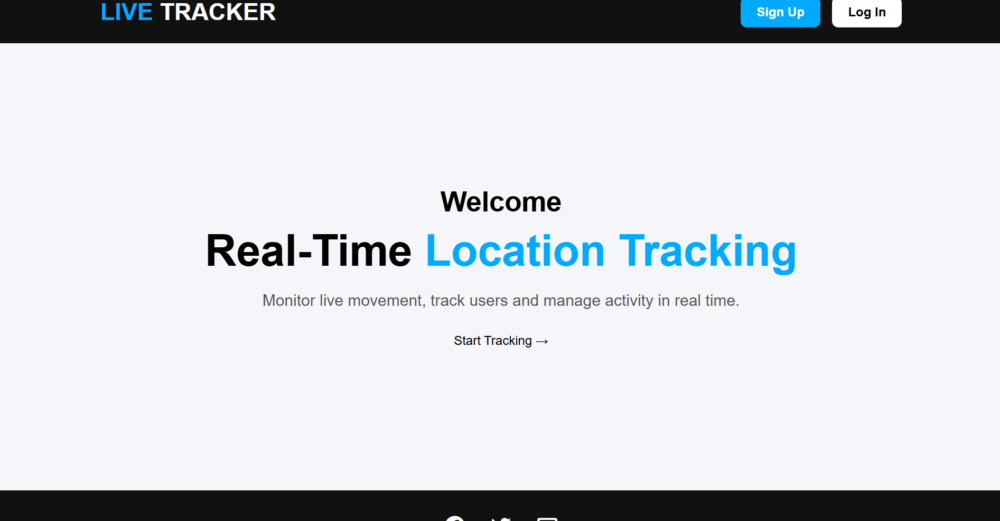
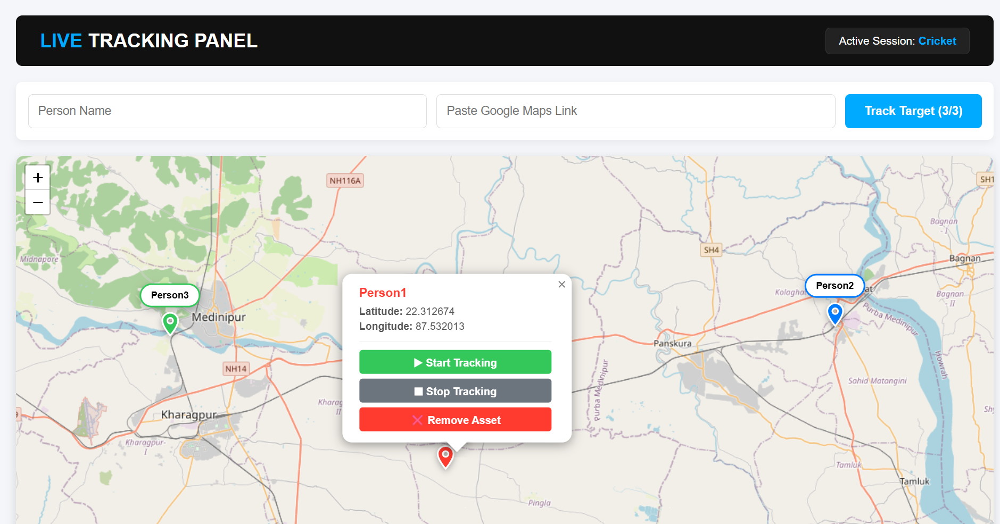
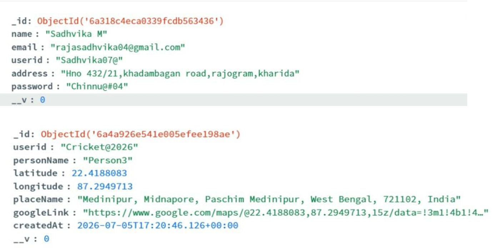

# 📍 Live Location Tracking System (Frontend)


---

# 📖 Project Overview

The **Live Location Tracking System** is a full-stack web application that allows users to submit a Google Maps location link and visualize the extracted coordinates on an interactive map. The frontend is developed using **React.js** and **Leaflet.js**, while the backend is built with **Node.js**, **Express.js**, and **MongoDB Atlas**.

This project demonstrates full-stack web development, REST API integration, interactive maps, and cloud deployment.

---

# 🚀 Live Demo

### 🌐 Frontend (Vercel)

👉 live-tracking-frontend-bxd5i4tg2-live-location-s-projects.vercel.app

### 🔗 Backend API (Render)

👉 https://live-tracker-backend-nj1r.onrender.com/

---

# 📂 Repositories

### ⚙️ Backend Repository

👉 [YOUR_BACKEND_REPO_URL](https://github.com/livelocationproject2026-byte/live-tracker-backend.git)

---

# ✨ Features

- 📍 Submit Google Maps location links
- 🗺️ Display extracted location on interactive Leaflet map
- 📌 Dynamic map marker updates
- 💾 Store location data in MongoDB Atlas
- 🔄 REST API integration with Express.js
- 📱 Responsive user interface
- ☁️ Cloud deployment using Vercel and Render

---

# 🛠️ Tech Stack

## Frontend

- React.js
- React Leaflet
- Leaflet.js
- HTML5
- CSS3
- JavaScript (ES6)

## Backend

- Node.js
- Express.js
- MongoDB Atlas
- Mongoose
- CORS

## Deployment

- Vercel (Frontend)
- Render (Backend)

---

# 📸 Screenshots

## Home Page

> Add a screenshot in the **images** folder.

```text
images/home.png
```

```markdown

```

---

## Location Tracking

```text
images/map.png
```

```markdown

```

---

## MongoDB Database

```text
images/database.png
```

```markdown

```

---

# ⚙️ Installation

## Clone Frontend Repository

```bash
git clone YOUR_FRONTEND_REPO_URL
```

Move into the project folder

```bash
cd live-tracker-frontend
```

Install dependencies

```bash
npm install
```

Start development server

```bash
npm start
```

The application will run on

```
http://localhost:3000
```

---

# 🔗 Backend Setup

Clone the backend repository

```bash
git clone YOUR_BACKEND_REPO_URL
```

Install packages

```bash
npm install
```

Run the backend server

```bash
npm start
```

The backend runs on

```
http://localhost:5000
```

Live API

```
https://live-tracker-backend-nj1r.onrender.com/
```

---

# 📁 Project Structure

```
live-tracker-frontend/
│
├── public/
│
├── src/
│   ├── components/
│   ├── App.js
│   ├── index.js
│   └── index.css
│
├── package.json
├── README.md
└── .gitignore
```

---

# 🔄 Workflow

```
User
   │
   ▼
React Frontend
   │
   ▼
Express API
   │
   ▼
MongoDB Atlas
   │
   ▼
Leaflet Map
```

---

# 🌟 Future Improvements

- User Authentication
- Live GPS Tracking
- Real-time Socket.IO Updates
- Route History
- Geofencing
- Multiple User Tracking
- Mobile Responsive UI
- Dark Mode

---

# 👩‍💻 Author

**Esha Shaw**

🔗 LinkedIn

https://www.linkedin.com/in/esha-shaw-956386281

🐙 GitHub

https://github.com/Esha0Shaw

---

# ⭐ Support

If you found this project helpful, please give this repository a ⭐ on GitHub.
